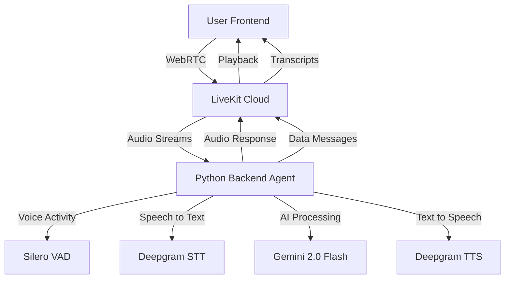

# LiveKit Voice Bot Architecture

## Current Implementation Status

### ✅ Completed (Frontend)
- **LiveKit React SDK Integration**: Using official `@livekit/components-react`
- **Token Generation**: Supabase Edge Function for secure JWT token creation
- **Room Management**: Automatic room creation and participant joining
- **Real-time Communication**: WebRTC audio streaming and data channels
- **Chat Integration**: Real-time transcript display and conversation history
- **UI Components**: Modern React interface with connection status and controls

### 🔄 In Progress (Backend)
- **Python Backend Template**: Complete LiveKit Agents implementation ready for deployment
- **Voice Pipeline**: Silero VAD + Deepgram STT/TTS + Gemini 2.0 Flash LLM
- **Deployment Scripts**: Docker and environment configuration for Railway/Render

### 📋 Required (External Deployment)
- **Python Backend Service**: Must be deployed to Railway, Render, or similar platform
- **Environment Configuration**: Set up API keys and LiveKit credentials
- **Health Monitoring**: Implement logging and monitoring for production use

## Technical Architecture

## Component Details

### Frontend (Lovable)
- **LiveKitVoiceChat.tsx**: Main component using official LiveKit React SDK
- **Token Generation**: `/functions/livekit-token` edge function
- **Real-time UI**: Connection status, audio visualization, chat history
- **Error Handling**: Graceful fallbacks and user feedback

### Backend (External Deployment Required)
- **livekit_agent.py**: Main agent implementation using `livekit-agents` framework
- **Voice Pipeline**: Complete STT→LLM→TTS pipeline with VAD
- **Real-time Processing**: Stream-based audio processing for low latency
- **Docker Support**: Ready for containerized deployment

### Infrastructure
- **LiveKit Cloud**: Managed WebRTC infrastructure for global scalability
- **Deepgram**: Real-time STT/TTS with streaming support
- **Gemini 2.0 Flash**: Fast LLM for conversational AI responses
- **Supabase**: Database and edge functions for supporting services

## Data Flow

### Conversation Initiation
1. User clicks "Start Voice Call" in frontend
2. Frontend generates LiveKit token via Supabase Edge Function
3. Frontend connects to LiveKit room using official React SDK
4. Backend agent automatically joins room when participant detected

### Voice Processing Loop
1. User speaks → LiveKit captures audio → Backend receives stream
2. Silero VAD detects voice activity → Triggers STT processing
3. Deepgram STT converts speech → Text sent to Gemini 2.0 Flash
4. Gemini generates response → Deepgram TTS creates audio
5. Audio streamed back → LiveKit delivers to frontend → User hears response

### Real-time Features
- **Interruption Support**: User can interrupt bot mid-sentence
- **Streaming Responses**: Partial transcripts and responses for low latency
- **Connection Recovery**: Automatic reconnection on network issues
- **Multi-participant**: Support for multiple users in same room

## Key Benefits

### Performance
- **Sub-500ms Latency**: Optimized pipeline for real-time conversation
- **Streaming Processing**: No batching delays in voice processing
- **Global Infrastructure**: LiveKit Cloud's worldwide edge network

### Scalability  
- **Serverless Frontend**: Lovable handles frontend scaling automatically
- **Backend Scaling**: Deploy agents across multiple regions as needed
- **Usage-based Billing**: Pay only for active conversation time

### Reliability
- **Official SDKs**: Using LiveKit's supported React components
- **Proven Architecture**: Following LiveKit's recommended patterns
- **Error Recovery**: Graceful handling of service disruptions

## Next Steps

1. **Deploy Backend**: Use provided Docker setup on Railway/Render
2. **Configure APIs**: Set environment variables for all services
3. **Test Integration**: Verify end-to-end voice conversation flow
4. **Monitor Performance**: Set up logging and alerts for production use
5. **Scale as Needed**: Add more backend instances for higher traffic

This architecture follows LiveKit's official best practices and delivers production-ready voice AI capabilities matching services like 11.ai and Vapi.ai.